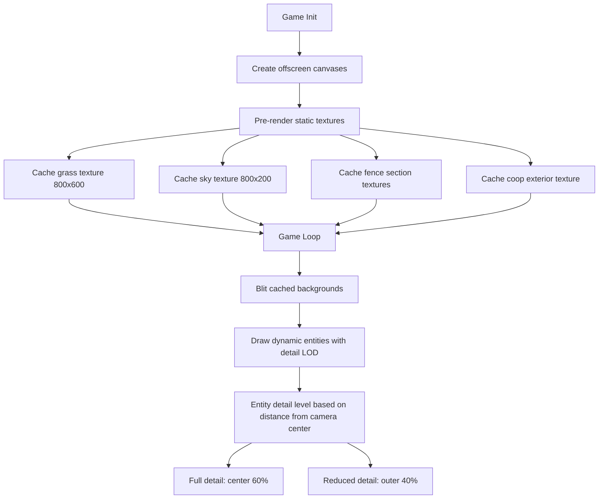
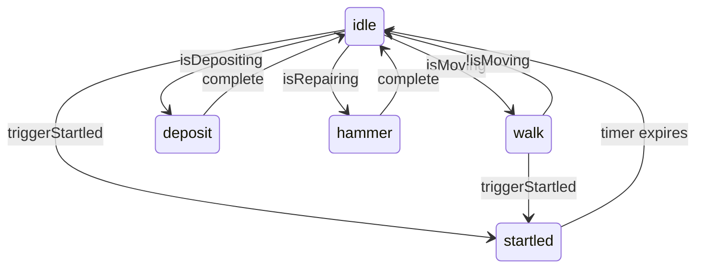
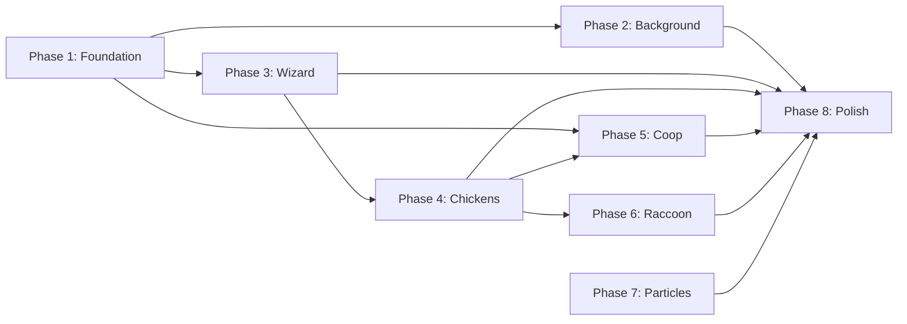

# Graphic Overhaul Plan — Illustrative Storybook Style

**Project:** Chickens: Wizard's Backyard  
**Goal:** Transform flat geometric graphics into hand-drawn illustrative storybook art  
**Constraints:** Canvas 2D only · 60 FPS · No gameplay/collision changes · Preserve animation state machine · Preserve `module.exports` footers  
**Last Updated:** 2026-02-12

---

## Table of Contents

1. [Art Direction](#1-art-direction)
2. [Background & Environment Overhaul](#2-background--environment-overhaul)
3. [Wizard Character Overhaul](#3-wizard-character-overhaul)
4. [Chicken Overhaul — All 12 Types](#4-chicken-overhaul--all-12-types)
5. [Coop / Barn Overhaul](#5-coop--barn-overhaul)
6. [Raccoon Overhaul](#6-raccoon-overhaul)
7. [Particle & Effects Overhaul](#7-particle--effects-overhaul)
8. [Implementation Order](#8-implementation-order)

---

## 1. Art Direction

### 1.1 Style Definition

**Target aesthetic: Warm ink-wash storybook illustration** — think *Winnie the Pooh* watercolor backgrounds crossed with *Don't Starve*'s hand-drawn character style, but friendlier and more colorful.

Key visual principles:

| Principle | Technique |
|-----------|-----------|
| **Organic edges** | Replace `fillRect` / `arc` calls with multi-point `bezierCurveTo` paths using slight randomization |
| **Layered depth** | 2–3 overlapping color layers per surface instead of single fills |
| **Visible texture** | Noise stippling, hatching lines, and grain overlays via semi-transparent patterns |
| **Warm lighting** | Subtle radial gradients simulating sunlight pooling from the sky |
| **Soft outlines** | Dark strokes with `lineWidth: 2–3` and `lineCap: 'round'` instead of sharp pixel edges |
| **Color bleeding** | Slight overlap of fill areas to mimic watercolor edge behavior |

### 1.2 Color Palette Evolution

The DESIGN.md palette is the *base*. Each color gains a rich/shadow/highlight triad:

```
Current → Enriched Triad
──────────────────────────────────────────────
#4CAF50 lawn     → base #4CAF50 · shadow #2E7D32 · highlight #81C784 · warm tint #A5D6A7
#87CEEB sky      → base #87CEEB · zenith #5B9BD5 · horizon #E8F4FD · cloud-glow #FFF8E1
#8b4513 fence    → base #8B4513 · grain-dark #5D3A1A · grain-light #D2A679 · knot #3E2723
#2d1b4e robe     → base #2D1B4E · fold-dark #1A0E30 · fold-light #4A2D7A · trim #7E57C2
#6D5A4B raccoon  → base #6D5A4B · underfur #8B7B6B · shadow #3E3226 · highlight #A89888
#ffffff chicken  → base #FFFAF0 · shadow #E8DDD0 · warm-white #FFF3E0 · outline #BDB09A
#B85450 barn-red → base #B85450 · deep #7B2E2B · weathered #D4837F · trim-gold #C9A96E
```

### 1.3 Lighting & Shading Approach

All shading uses **Canvas 2D radial/linear gradients** and **layered semi-transparent fills**:

1. **Global light source:** Top-right (consistent sun position). Every entity gets a highlight arc on the top-right quadrant and a shadow arc on the bottom-left.
2. **Ground shadow:** Each entity casts an ellipse shadow offset 3–5px down-right from center, using `rgba(0,0,0,0.15)` with a radial gradient falloff.
3. **Ambient occlusion:** Where objects meet the ground (fence bases, coop foundation, tree trunks), a darker gradient band simulates contact shadow.
4. **Highlight rims:** A thin `strokeStyle` arc of the highlight color on the light-facing edge of rounded objects.

### 1.4 Texture Techniques — Canvas 2D Toolkit

| Technique | Use Case | Implementation |
|-----------|----------|----------------|
| **Noise stippling** | Grass, dirt, fur, feathers | Loop of `fillRect(x,y,1,1)` with pseudo-random offsets seeded by position. Cache to offscreen canvas. |
| **Linear gradient layers** | Wood grain, sky, robes | Stack 2–3 `createLinearGradient` fills with varying alpha |
| **Hatching lines** | Shading on wood, stone | Array of short `lineTo` calls at 45° angle in shadow regions |
| **Bezier wobble** | Organic outlines | Replace straight `lineTo` with `quadraticCurveTo` using small random control-point offsets |
| **Radial glow** | Magic effects, highlights | `createRadialGradient` from full-color center to transparent edge |
| **Offscreen canvas caching** | Static textures | Pre-render grass, wood-grain, and sky textures to offscreen canvases on init; blit each frame |
| **Dithered edges** | Watercolor bleed effect | Draw a slightly larger, lower-alpha fill behind the main shape |

### 1.5 Performance Strategy



**Key performance rules:**

- Static backgrounds (sky, grass, fences) rendered to offscreen canvas **once** on game init and redrawn only on resize
- Noise/stipple textures pre-generated into tile-able offscreen canvases (e.g., 64x64 grass tile)
- Maximum 200 stipple dots per entity per frame
- Use `ctx.drawImage(offscreenCanvas, ...)` instead of re-drawing complex static scenes each frame
- Entity draw calls stay under 50 Canvas API calls per entity (current average: ~25)

---

## 2. Background & Environment Overhaul

### 2.1 Current State Analysis

| Element | Current Implementation | File | Lines |
|---------|----------------------|------|-------|
| Sky | Single linear gradient `#87CEEB → #E0F6FF` + 3 static circle-based clouds | `renderer.js` | `drawSky()` L38–51 |
| Lawn | Flat `#4CAF50` fill + 15% opacity mowing stripes + 100 random 2px dots | `renderer.js` | `drawLawn()` L176–198 |
| North fence | White pickets with pointed tops, 8px wide, gray stroke outlines | `renderer.js` | `drawNorthFence()` L63–98 |
| East/West fences | White pickets rotated 90°, 5px wide, gray outlines | `renderer.js` | `drawEastFence()` / `drawWestFence()` L100–174 |
| House siding | Flat `#f5f5f5` fill below y=600 with horizontal lines | `renderer.js` | `drawHouseSiding()` L200–217 |
| House roof | Brown triangle with horizontal shingle lines, clipped | `renderer.js` | `drawHouseRoof()` L219–262 |
| Props | Simple geometric gnome, flamingo, grill, flower pots, tree | `renderer.js` | `drawProps()` L341–516 |

### 2.2 Sky Overhaul

**Target:** Warm watercolor sky with depth and soft clouds

Changes to [`drawSky()`](renderer.js:38):

1. **Richer gradient** — 4 stops: deep sky blue at zenith → powder blue → peach-tinted white at horizon → faint warm wash
2. **Cloud rendering** — Replace solid white circles with layered semi-transparent ellipses:
   - Base layer: `rgba(255,255,255,0.3)` large ellipse
   - Middle layer: `rgba(255,255,255,0.5)` medium ellipse offset slightly
   - Highlight layer: `rgba(255,255,255,0.7)` small bright spot
   - Shadow underneath: `rgba(180,200,220,0.2)` flat ellipse
3. **Subtle sun glow** — Radial gradient in top-right corner: `rgba(255,240,200,0.15)` → transparent
4. **Cache** — Entire sky rendered to offscreen canvas on init since it's static

Changes to [`drawCloud()`](renderer.js:53):

- Accept `time` parameter for very slow drift (`x += Math.sin(time * 0.1) * 2`)
- Each cloud built from 5–7 overlapping ellipses with varying alpha
- Soft shadow ellipse below each cloud

### 2.3 Grass / Lawn Overhaul

**Target:** Lush, textured grass with mowing patterns and natural variation

Changes to [`drawLawn()`](renderer.js:176):

1. **Pre-rendered grass texture tile** (64x64 offscreen canvas):
   - Base color fill
   - 200 stipple dots in 4 green shades
   - 30 tiny blade-shaped marks (2x6px rectangles at slight angles)
   - Tile across lawn area using `ctx.drawImage`
2. **Mowing stripes** — Replace flat color stripes with sinusoidal-edge stripes:
   - Use `bezierCurveTo` for wavy stripe edges
   - Alternate between two grass tones with 10% opacity
3. **Edge darkening** — Radial gradient overlay: darker at fence edges, lighter in center
4. **Scattered details** (drawn once to cached canvas):
   - Small flower clusters (3-petal shapes) in warm colors
   - Tiny stones (gray ellipses with highlight dot)
   - Clover patches (3 small circles in triangle formation)
   - Darker patches simulating bare earth
5. **Dynamic grass** — Near moving entities, draw 3–5 small blade shapes that bend away from movement direction (cheap: just small lines with angle offset)

### 2.4 Fence Overhaul — All Three Sides

**Target:** Weathered white wooden fence with visible grain, knots, and slight irregularity

Changes to [`drawNorthFence()`](renderer.js:63), [`drawEastFence()`](renderer.js:100), [`drawWestFence()`](renderer.js:138):

1. **Wood grain texture per picket:**
   - Base off-white fill
   - 2–3 vertical gray lines per picket (grain)
   - Random knot (small dark circle) on ~15% of pickets
   - Slight color variation between pickets (`#f8f8f8` to `#e8e4df`)
2. **Pointed tops** — Replace triangle with `bezierCurveTo` for slightly rounded/organic point shape
3. **Weathering:**
   - Lower 20% of each picket gets a slightly darker/greener tint (grass staining)
   - Random hairline cracks (thin dark lines) on ~10% of pickets
4. **Shadow & depth:**
   - Each picket casts a 2px shadow to the right (light from left)
   - Horizontal rails drawn with subtle 3D beveling (light top edge, dark bottom edge)
5. **Cross-rails** — Add visible nail/bolt dots where rails meet pickets
6. **Cache** — All three fences rendered to a single offscreen canvas on init

### 2.5 House Siding & Roof Overhaul

Changes to [`drawHouseSiding()`](renderer.js:200):

1. **Clapboard texture** — Replace horizontal lines with:
   - Alternating slightly-different off-white tones per board
   - Shadow line at bottom of each board (darker)
   - Highlight line at top of each board (lighter)
   - Occasional knot or imperfection

Changes to [`drawHouseRoof()`](renderer.js:219):

1. **Shingle texture:**
   - Replace horizontal lines with staggered shingle pattern (brick-like offset)
   - Each shingle: small rounded rectangle with shadow at bottom edge
   - Color variation per shingle (2–3 brown tones)
2. **Ridge cap** — Darker line along the peak with slight thickness
3. **Weathering** — A few shingles with slightly different rotation/position for worn look
4. **Roof overhang shadow** — Gradient shadow on siding just below roof line

Changes to [`drawRoofOverlayAtX()`](renderer.js:271) and [`drawRoofOverlay()`](renderer.js:337):

- Same shingle texture approach
- Ensure clipping still works with the new detail level

### 2.6 Props Overhaul

Changes to [`drawGnome()`](renderer.js:359):

- Add face details (dot eyes, rosy cheeks, smile)
- Robe folds via gradient
- Beard with wavy edge using `bezierCurveTo`
- Hat with slight bend/tilt

Changes to [`drawFlamingo()`](renderer.js:395):

- Feather texture on body (overlapping small ellipses)
- More natural leg bend
- Eye with pupil

Changes to [`drawGrill()`](renderer.js:436):

- Metallic sheen gradient on lid
- Grate lines visible on top
- Small smoke wisps (animated: 2–3 semi-transparent circles drifting up)

Changes to [`drawFlowerPot()`](renderer.js:468):

- Terra cotta texture (gradient + horizontal line)
- Individual petal shapes instead of solid circles
- Leaf shapes on stems

Changes to [`drawTree()`](renderer.js:500):

- Trunk with bark texture (vertical hatching lines)
- Leaf canopy: 15–20 overlapping small circles in 3 green shades
- Small shadow on trunk side facing away from light
- Dappled shadow on ground beneath tree

---

## 3. Wizard Character Overhaul

### 3.1 Current Animation System Analysis

The wizard uses a **pose-interpolation state machine**:



**Architecture:**

- [`WizardAnimator`](wizardAnimator.js:6) manages state transitions with 150ms blend
- [`WIZARD_ANIMATIONS`](wizardAnimations.js:1) provides per-state frame arrays
- Each frame defines: `bodyY`, `bodyScaleY`, `bodyRotation`, limb angles/positions, `hatRotation`, `hatY`, `robeFlare`, `beardSway`, `staffAngle`
- [`interpolatePose()`](wizardAnimator.js:103) lerps between frames
- [`drawBody()`](wizardAnimator.js:163) renders all parts in order: shadow → robe → head → eyes → beard → hat → staff → legs → arms

### 3.2 Visual Enhancement Plan

**The state machine and pose data structure are preserved.** Only the rendering in `drawBody()` and sub-methods changes.

#### 3.2.1 Robe

Current: Single `#2d1b4e` ellipse + `#3d2b5e` flare quadratic.

New:
- **Base shape:** Keep ellipse but add `bezierCurveTo` hem at bottom for wavy edge
- **Fabric gradient:** `createLinearGradient` from darker at top to lighter at bottom-center
- **Fold lines:** 2–3 thin curved lines (`quadraticCurveTo`) in slightly darker purple, following body curve
- **Flare enhancement:** The existing `robeFlare` parameter drives hem width — add secondary motion by varying the bezier control points based on `robeFlare` value
- **Star/moon pattern:** Tiny gold dots (2–3) on robe using `fillRect(x,y,2,2)` in `#ffd70060`
- **Rim highlight:** Thin stroke on light-facing edge in `#7E57C2`

#### 3.2.2 Head & Face

Current: Single peach circle + two black rectangles for eyes.

New:
- **Head shape:** Slightly wider ellipse for more character
- **Eyes:** Replace rectangles with proper eye shapes:
  - White sclera ellipse
  - Dark iris circle
  - Tiny white highlight dot
  - Eyelid curve above (skin-colored arc)
- **Nose:** Small downward-pointing triangle or dot
- **Mouth:** Subtle curved line (smile)
- **Rosy cheeks:** Two `rgba(255,150,150,0.3)` circles
- **Eyebrows:** Short angled lines above eyes (can animate with expression)

#### 3.2.3 Beard

Current: White `quadraticCurveTo` leaf shape with sway.

New:
- **Multi-strand effect:** 3–4 overlapping curved shapes in slightly different whites/grays
- **Wavy bottom edge:** Replace single curve with 3-point `bezierCurveTo` for flowing edge
- **Texture:** A few thin darker lines within beard shape for strand detail
- **Enhanced sway:** Use `beardSway` to drive each strand independently (multiply by 0.8, 1.0, 1.2 for depth)

#### 3.2.4 Hat

Current: Purple ellipse base + cone via `quadraticCurveTo` + gold band rectangle.

New:
- **Cone shape:** More organic curve — droopy/bent tip using additional bezier control point
- **Fabric folds:** 1–2 horizontal curves across cone suggesting wrinkled fabric
- **Band detail:** Gold band with tiny star/gem in center (diamond shape)
- **Tip detail:** Small dangling star or orb at droopy tip
- **Texture:** Subtle vertical gradient (darker at base, slightly lighter at tip)

#### 3.2.5 Staff

Current: Brown vertical line + cyan pulsing circle + glow circle.

New:
- **Shaft:** Replace straight line with slightly curved path (gentle S-curve)
- **Wood texture:** Two-tone brown with a visible knot
- **Crystal:** Replace circle with diamond/hexagonal shape, multi-layered:
  - Inner bright core
  - Middle translucent layer
  - Outer glow with color cycling (`hue-shift` via HSL)
- **Magic particles:** 2–3 tiny sparkle dots orbiting the crystal tip (use `time` parameter for rotation)
- **Staff base:** Small foot detail where shaft meets hand

#### 3.2.6 Legs & Arms

Current: Rectangular fills for legs, rectangular fills + circle hands for arms.

New:
- **Legs:** Rounded rectangles (use `arc` for rounded ends) in dark color with boot shape at bottom (small wider rectangle)
- **Arms:** Tapered rectangles (wider at shoulder, narrower at wrist)
- **Hands:** Keep circles but add a second smaller circle for thumb
- **Sleeve cuffs:** Small band of different color where arm meets robe
- **Boot detail:** Tiny buckle (gold rectangle) on each boot

### 3.3 Animation Improvements

**Preserve all existing frame data in** [`wizardAnimations.js`](wizardAnimations.js:1). **Add new properties to existing frame objects:**

New properties per frame:
```javascript
{
    // ... existing properties preserved ...
    robeSwayL: 0,      // Left hem offset
    robeSwayR: 0,      // Right hem offset  
    beardStrands: [0, 0, 0], // Per-strand sway offsets
    hatDroop: 0,        // Tip droop amount
    eyeBlink: 0,        // 0 = open, 1 = closed
    mouthShape: 0,      // 0 = neutral, 1 = smile, -1 = frown
    crystalGlow: 1.0,   // Crystal brightness multiplier
    squashX: 1.0,       // Horizontal squash/stretch
}
```

**Frame data changes per state:**

- **Idle:** Add `eyeBlink: 1` on frames 10 and 12 for periodic blinking (~every 2 seconds). Add slow `crystalGlow` pulse between 0.7–1.0.
- **Walk:** Add `robeSwayL/R` alternating ±3 for fabric flow. Increase `beardSway` range. Add `squashX` variation (0.98–1.02) for bounce.
- **Startled:** Add `eyeBlink: 0` (wide open), `mouthShape: -1`, large `hatDroop` on final frame, spike `crystalGlow` to 1.5.
- **Deposit:** Add gentle `robeSwayL/R` and slow `beardSway` for kneeling motion feel.
- **Hammer:** Add impact frame with `squashX: 0.95` for strike recoil.

### 3.4 Secondary Motion

Add to [`drawBody()`](wizardAnimator.js:163):

- **Robe trailing:** When walking, the robe hem on the trailing side lifts slightly higher (use `lastVelocityX` direction)
- **Hat physics:** Hat tilts slightly in the direction opposite to movement (inertia feel) — already partially supported by `hatRotation`, but increase the range
- **Staff bob:** Staff should have a slight delay/overshoot on movement start/stop — add a spring-damper calculation in the draw method using `staffAngle`

---

## 4. Chicken Overhaul — All 12 Types

### 4.1 Current Rendering Analysis

**Base Chicken** ([`chicken.js`](chicken.js:523) `drawBody()`):

- Shadow ellipse
- Body: single-color ellipse (12x10)
- Wing: slightly smaller same-color ellipse
- Head: circle
- Beak: triangle
- Eye: small black circle
- Comb: red half-circle
- Legs: two straight orange lines

**Typed Chicken** ([`chickenTypes.js`](chickenTypes.js:418) `drawTypedBody()`):

- Same structure as base but with `sizeMod` scaling
- `bodyColor` / `accentColor` per type
- Optional pattern overlay (stripes, stars, music notes, etc.)
- Optional horn (rainbow), mask (sneaky), eye type (sleepy)

### 4.2 New Feather Rendering Technique

Replace single ellipse body with **layered feather system**:

```
Layer 1: Base body shape (larger ellipse, slightly bottom-heavy)
Layer 2: Breast feathers (3-4 overlapping small ellipses, lighter color)  
Layer 3: Wing feathers (5-7 overlapping tear-drop shapes, accent color)
Layer 4: Tail feathers (2-3 angled elongated ellipses at rear)
Layer 5: Head plumage (circle + 2-3 small feather tufts on top)
```

**Each feather:** Small ellipse or tear-drop drawn with `bezierCurveTo`, with:

- Base color fill
- Slightly darker stroke outline
- Tiny highlight arc on light side

**Performance:** Maximum 20 shapes per chicken (vs current 8). Use size-based LOD — chickens in coop windows use simplified 5-shape version.

### 4.3 Per-Type Visual Differentiation

| Type | Body Color | Unique Visual Features |
|------|-----------|----------------------|
| **Rainbow** | White `#ffffff` | Iridescent wing tips: cycle through rainbow gradient per frame. Horn with spiral texture. Sparkle trail behind. |
| **Rocket** | Red `#ff4444` | Swept-back head feathers (speed lines). Orange-tipped tail feathers. Flame particle effect when boosting. |
| **Sleepy** | Gray `#888888` | Droopy eyelids (half-closed ellipse). Pillow-shaped body (wider, flatter). Zzz floating text particles. Nightcap on head. |
| **Sneaky** | Dark gray `#4a4a4a` | Bandit mask across eyes. Shifty eye animation (pupils dart left-right). Low crouch posture. Shadow is darker/larger. |
| **Lucky** | Gold `#ffd700` | Glowing outline. Four-leaf clover pattern on breast. Coin-like sheen gradient on body. Sparkle particles. |
| **Music** | Purple `#9370db` | Musical note shapes in wing feathers. Tiny floating note particles. Beret-style head tuft. |
| **Tank** | Slate `#708090` | 1.3x size. Armor-plate pattern on body (overlapping hexagonal shapes). Helmet-shaped comb. Thick legs. |
| **Night** | Navy `#191970` | Star speckle pattern (tiny white dots). Crescent moon shape on wing. Glowing eyes. Owl-like ear tufts. |
| **Sunny** | Yellow `#ffeb3b` | Sunflower-petal comb (8 petals). Orange-tipped wing feathers. Warm glow aura. Happy expression (curved beak). |
| **Hungry** | Brown `#d2691e` | 1.2x size. Rotund body (more circular). Crumb particles near beak. Bib-shaped breast marking. |
| **Circus** | Hot pink `#ff1493` | Alternating pink/cyan stripe pattern on feathers. Ruffle collar around neck. Juggling-ball sized eye. |
| **Ghost** | White `#f0f0f0` | Semi-transparent (`alpha: 0.7`). Wispy feather edges (fade to transparent). Floating slightly above shadow. No legs visible. |

### 4.4 Chicken Animation Improvements

**New animations to add to base chicken** ([`chicken.js`](chicken.js:476)):

1. **Head bob while walking** — Sinusoidal Y offset on head circle: `headY = baseY - 8 + Math.sin(time * 6) * 2`
2. **Wing flap** — When moving fast or startled, wing ellipse rotates ±15° over 4 frames
3. **Tail wag** — Tail feathers sway using `Math.sin(time * 3) * 0.1` rotation
4. **Pecking animation** — When idle near food: head dips down (Y offset +5) and beak opens (two triangles separating)
5. **Dust kick** — When starting to move: spawn 3–5 tiny brown particles behind feet
6. **Egg laying wobble** — Body squash/stretch cycle when transitioning to `laying` state

**Egg visual improvements** ([`chicken.js`](chicken.js:604) `drawEggIndicator()`):

- Replace plain white ellipse with shaded egg:
  - Base fill with vertical gradient (white top → cream bottom)
  - Shadow curve on bottom-left
  - Highlight spot on top-right
  - Golden eggs: gold gradient with sparkle dot
- Egg "wobble" before hatching: rotation oscillation ±5°

### 4.5 Coop Window Chicken Rendering

The in-window chicken sprites at [`drawNestingChicken()`](coop.js:746) need a simplified but still illustrative version:

- Simpler 3-shape body (body ellipse + head circle + wing ellipse)
- Type-specific accent color visible
- Tiny animated detail (head bob)
- Straw nest beneath (already exists — enhance with 3–4 more straw lines)

---

## 5. Coop / Barn Overhaul

### 5.1 Current Rendering Analysis

[`Coop.draw()`](coop.js:417) calls:

- [`drawShed()`](coop.js:429): Shadow ellipse → `drawCoopExterior()` → `drawWindowsRealistic()`
- [`drawDoor()`](coop.js:424): South-wall door

[`drawCoopExterior()`](coop.js:443):

- Gray triangle roof with gradient and horizontal shingle lines
- Brown wood body with horizontal plank lines
- Barn-red corner trim
- Gray stone foundation with vertical lines
- Cream "COOP" sign

[`drawWindowsRealistic()`](coop.js:592):

- 2x6 grid of windows with cream frames, cross-bar muntins
- Interior: dark wood gradient with straw dots
- Chicken emoji in occupied windows

### 5.2 New Barn Details

#### Roof

- **Individual shingles:** Staggered rows of small rounded rectangles in 3 gray tones
- **Ridge cap:** Raised darker strip along the peak
- **Weathering:** A few shingles with slightly different color or small gap
- **Shadow:** Roof casts gradient shadow on the front wall below

#### Walls

- **Wood grain:** Each plank gets 1–2 thin grain lines and occasional knot circle
- **Color variation:** Each plank row alternates between two similar brown tones
- **Weathering:** Random darker patches (water stains), lighter patches (sun bleaching)
- **Nail heads:** Tiny dark dots where planks meet trim

#### Foundation

- **Individual stones:** Replace vertical lines with interlocking stone shapes (rounded rectangles of varying sizes)
- **Mortar lines:** Slightly lighter color between stones
- **Moss:** A few tiny green dots near bottom corners

#### Sign

- **Hanging sign:** Replace flat rectangle with sign-on-chains appearance:
  - Two short chain segments (series of small circles) from roof
  - Wooden plaque with beveled edge (darker stroke)
  - Hand-lettered "COOP" text with slight wobble

### 5.3 Window Rendering Improvements

Changes to [`drawWindowFrame()`](coop.js:628):

- **Frame depth:** Double-stroke to create 3D frame illusion (outer dark, inner light)
- **Shutters hint:** Tiny angled lines suggesting shutters on each side
- **Sill:** Small rectangle below window with shadow
- **Curtain hint:** Tiny fabric curves at top inside corners (`bezierCurveTo` in cream color)

Changes to [`drawNestInterior()`](coop.js:662):

- **Warmer interior:** Replace dark gradient with warm brown-orange gradient
- **More straw:** Increase straw elements, make them longer and crossing
- **Depth:** Subtle darker corners for interior depth

### 5.4 Fence Integration

The coop barrier is rectangular and invisible. Add visual integration:

- **Small fence section** connecting coop sides to nearby arena fences (if applicable)
- **Chicken wire:** Semi-transparent grid pattern on coop front below windows
- **Gate detail:** Door gets hinges (two dark rectangles on one side) and a handle (small circle)

---

## 6. Raccoon Overhaul

### 6.1 Current Rendering Analysis

[`Raccoon.draw()`](raccoon.js:351):

- Shadow ellipse
- Body: brown-gray oval (16x12)
- Lighter belly oval
- Head: circle with black mask ellipse
- Eyes: white circles with black pupils
- Nose: small black circle
- Ears: two triangles with lighter inner triangles
- Striped tail: ellipse with 3 black circles
- Paws: two black circles
- States: spawning (scale up), fleeing (alpha 0.7), entering/exiting (alpha 0.8), waddle rotation
- Special: [`drawChickenInMouth()`](raccoon.js:508), [`drawPunchPose()`](raccoon.js:549)

### 6.2 Fur Rendering

Replace single-fill body with layered fur technique:

1. **Base body shape:** Keep oval but make slightly more organic with `bezierCurveTo`
2. **Fur texture overlay:** 15–20 tiny short lines radiating outward from body center in fur direction
3. **Color banding:** 2–3 concentric fills from dark center to lighter outer edge
4. **Belly:** Lighter oval with soft edges (feathered circle using radial gradient)
5. **Tail:** Replace ellipse + circles with:
   - Curved path (quadratic curve) for tail shape
   - Alternating dark/light bands using clipped fills
   - Fluffy tip (cluster of small circles)

### 6.3 Facial Features & Expressions

**Enhanced mask:**

- Mask shape follows eye contours with pointed edges (raccoon mask shape via bezier paths)
- White fur patches above and below mask
- Whiskers: 3 thin lines on each side of nose

**Expressive eyes:**

| State | Eye Expression |
|-------|---------------|
| Approaching | Narrowed (squinting), pupils looking toward coop |
| Inside coop | Wide open with mischief sparkle (tiny white dot) |
| Dragging | Determined squint, one eye partially closed |
| Fleeing | Wide oval eyes, pupils dilated |
| Punch pose | Angry: angled eyebrows, red-tinted sclera |

**Mouth:**

- Add a curved line for mouth
- Grin when inside coop or dragging
- Grimace when fleeing
- Snarl during punch

### 6.4 Animation Improvements

**Sneaking animation** (approaching state):

- Lower body posture (compress `bodyY` downward)
- Exaggerated tip-toe paw placement
- Ears flattened (reduce ear triangle height)
- Tail held low and still

**Stealing animation** (inside coop → dragging):

- Quick grab motion: body lunges forward
- Chicken clutched tightly (compress chicken-in-mouth sprite)
- Triumphant ear perk

**Fleeing animation:**

- Full sprint posture (elongated body)
- Ears fully back
- Tail streaming behind
- Speed lines particle effect

**Punch animation** ([`drawPunchPose()`](raccoon.js:549)):

- Impact frame with screen-shake suggestion (slight offset of raccoon position)
- Wood splinter particles already exist — add impact star burst shape
- Raccoon body recoil after hit

---

## 7. Particle & Effects Overhaul

### 7.1 Current Effects Analysis

| Class | Use | Shape | File |
|-------|-----|-------|------|
| [`Particle`](particle.js:4) | Catch, escape, spell bursts | Circle | `particle.js` L4–85 |
| [`WizardSparkle`](particle.js:91) | Wizard trail | Circle with shadowBlur | `particle.js` L91–120 |
| [`MagicBurst`](particle.js:126) | Chicken catch | Diamond shape | `particle.js` L126–170 |
| [`MagicRune`](particle.js:176) | Chicken catch | Geometric symbols | `particle.js` L176–245 |
| [`PawPrint`](particle.js:251) | Raccoon trail | Pad + 4 toe circles | `particle.js` L251–287 |
| [`StarBurst`](particle.js:293) | Raccoon intercept | 5-point star | `particle.js` L293–343 |
| [`WoodParticle`](particle.js:349) | Fence punch | Rectangle | `particle.js` L349–386 |

### 7.2 New Particle Styles — Illustrative Feel

**Universal changes:**

- Replace all `shadowBlur` usage with manual glow (radial gradient circle behind shape) — `shadowBlur` is expensive on some GPUs
- Add slight rotation to all particles (even circles) for organic feel
- Add trail rendering: each particle draws a fading line from current to previous position

#### Catch Effect (`Particle` type `'catch'`)

Current: Gold circles.

New:
- Mix of gold circles AND tiny feather shapes (tear-drop with line through middle)
- 40% feathers, 60% sparkles
- Feathers have physics: gravity + air resistance + tumble rotation
- Sparkles have burst pattern then float up

#### Escape Effect (`Particle` type `'escape'`)

Current: Gray circles with gravity.

New:
- Brown dust clouds: circles that grow in size as they age
- Mixed with tiny leaf/debris shapes (small rotating rectangles in earth tones)
- Poof shape: initial burst outward then slow upward drift

#### Spell Effects (freeze, attract, speed)

**Freeze burst:**
- Snowflake shapes (6-armed star using `lineTo` calls) instead of blue circles
- Ice crystal fragments (diamond shapes) that shatter outward
- Frosty ground ring: expanding circle outline that fades

**Attract burst:**
- Spiral particle paths (use parametric spiral equation)
- Purple/magenta energy wisps (elongated ellipses that orbit toward center)
- Runic circle appearance (thin circle outline with symbols that fades)

**Speed burst:**
- Yellow lightning bolt shapes (zigzag `lineTo` paths)
- Speed lines (long thin rectangles) emanating from wizard
- Afterimage effect: previous position drawn at 30% alpha

### 7.3 Wizard Sparkle Enhancement

Changes to [`WizardSparkle`](particle.js:91):

- Replace circle with 4-point star shape (rotated square with small points)
- Add color variation: occasional warm gold mixed with cool cyan
- Twinkle effect: alpha oscillates during lifetime instead of linear decay

### 7.4 Magic Burst & Rune Enhancement

Changes to [`MagicBurst`](particle.js:126):

- Diamond shapes PLUS swirling energy wisps (curved lines)
- Multi-colored: each burst particle gets a random hue from teal-to-purple range
- Core flash: initial frame has a large bright circle that shrinks rapidly

Changes to [`MagicRune`](particle.js:176):

- More rune variety: add 4 more rune types (crescent, infinity loop, spiral, pentagram)
- Runes pulse in brightness during their lifetime
- Slight glow ring around each rune (thin circle outline)

### 7.5 Raccoon Effect Enhancement

Changes to [`PawPrint`](particle.js:251):

- More detailed paw: individual toe bean circles with slight size variation
- Slight mud color variation based on position (greener near coop, browner near fences)
- Prints fade from dark to light over lifetime

Changes to [`StarBurst`](particle.js:293):

- Mix stars with exclamation marks and comic-style impact shapes
- Add concentric expanding ring outline effect
- Central flash that fades quickly

### 7.6 Wood Particle Enhancement

Changes to [`WoodParticle`](particle.js:349):

- Splinter shapes: vary between rectangles, triangles, and irregular polygons
- Add sawdust: tiny 1px particles in light wood color
- Some splinters should stick in the ground (stop moving when Y reaches spawn Y + offset)

---

## 8. Implementation Order

### 8.1 Phase 1 — Foundation & Caching Infrastructure

Build the performance infrastructure first so all subsequent changes benefit from it.

| # | File | Change | Complexity |
|---|------|--------|------------|
| 1 | `renderer.js` | Add `TextureCache` class with offscreen canvas management | Medium |
| 2 | `renderer.js` | Add shared utility functions: `wobblePath()`, `stippleRect()`, `organicEllipse()`, `woodGrain()` | Medium |
| 3 | `renderer.js` | Implement sky pre-rendering to offscreen canvas | Low |
| 4 | `renderer.js` | Implement grass texture tile pre-rendering | Medium |

### 8.2 Phase 2 — Background & Environment

Static elements that set the visual tone for everything else.

| # | File | Change | Complexity | Depends On |
|---|------|--------|------------|------------|
| 5 | `renderer.js` | Overhaul `drawSky()` with richer gradient + improved clouds | Low | Phase 1 |
| 6 | `renderer.js` | Overhaul `drawLawn()` with textured grass and scattered details | Medium | Phase 1 |
| 7 | `renderer.js` | Overhaul `drawNorthFence()` with wood grain and weathering | Medium | Phase 1 |
| 8 | `renderer.js` | Overhaul `drawEastFence()` and `drawWestFence()` | Medium | #7 |
| 9 | `renderer.js` | Overhaul `drawHouseSiding()` with clapboard texture | Low | Phase 1 |
| 10 | `renderer.js` | Overhaul `drawHouseRoof()` with individual shingles | Medium | Phase 1 |
| 11 | `renderer.js` | Overhaul `drawRoofOverlayAtX()` to match new roof style | Low | #10 |
| 12 | `renderer.js` | Overhaul all prop drawings (gnome, flamingo, grill, pots, tree) | Medium | Phase 1 |

### 8.3 Phase 3 — Wizard Character

The most complex entity with the most animation frames.

| # | File | Change | Complexity | Depends On |
|---|------|--------|------------|------------|
| 13 | `wizardAnimator.js` | Enhance `drawBody()` — robe gradient, fold lines, star pattern | High | None |
| 14 | `wizardAnimator.js` | Enhance head rendering — proper eyes, nose, mouth, cheeks | Medium | None |
| 15 | `wizardAnimator.js` | Enhance beard rendering — multi-strand, texture | Medium | None |
| 16 | `wizardAnimator.js` | Enhance hat rendering — droopy tip, fabric folds, gem band | Medium | None |
| 17 | `wizardAnimator.js` | Enhance staff rendering — curved shaft, detailed crystal | Medium | None |
| 18 | `wizardAnimator.js` | Enhance `drawLeg()` and `drawArm()` — boots, sleeve cuffs | Low | None |
| 19 | `wizardAnimations.js` | Add new frame properties: `robeSwayL/R`, `eyeBlink`, `mouthShape`, `crystalGlow`, `squashX` | Medium | #13 |
| 20 | `wizardAnimator.js` | Update `interpolatePose()` to handle new properties | Low | #19 |
| 21 | `hero.js` | Update `drawSprintTrail()` with afterimage effect | Low | #13 |
| 22 | `hero.js` | Update tool icons (basket, hammer) for illustrative style | Low | None |

### 8.4 Phase 4 — Chickens

| # | File | Change | Complexity | Depends On |
|---|------|--------|------------|------------|
| 23 | `chicken.js` | Rewrite `drawBody()` with layered feather system | High | None |
| 24 | `chicken.js` | Add head bob, wing flap, tail wag animations | Medium | #23 |
| 25 | `chicken.js` | Enhance `drawEggIndicator()` with shaded egg | Low | None |
| 26 | `chicken.js` | Add pecking and dust-kick micro-animations | Medium | #24 |
| 27 | `chickenTypes.js` | Rewrite `drawTypedBody()` to use new feather system with per-type features | High | #23 |
| 28 | `chickenTypes.js` | Update all 12 type-specific visual features per spec | High | #27 |
| 29 | `chickenTypes.js` | Enhance `drawPattern()` for all pattern types | Medium | #27 |
| 30 | `chickenTypes.js` | Add per-type special effect particles (rainbow trail, flame tail, zzz, etc.) | Medium | #28 |

### 8.5 Phase 5 — Coop

| # | File | Change | Complexity | Depends On |
|---|------|--------|------------|------------|
| 31 | `coop.js` | Enhance `drawCoopExterior()` — wood grain, weathering, detailed roof | High | Phase 1 |
| 32 | `coop.js` | Enhance `drawWindowFrame()` — depth, sill, curtain hints | Medium | None |
| 33 | `coop.js` | Enhance `drawNestInterior()` and `drawEmptyWindow()` | Low | None |
| 34 | `coop.js` | Update `drawNestingChicken()` family to match new chicken style | Medium | #23 |
| 35 | `coop.js` | Add door hinges, handle, chicken wire details | Low | None |
| 36 | `coop.js` | Update hanging sign rendering | Low | None |

### 8.6 Phase 6 — Raccoon

| # | File | Change | Complexity | Depends On |
|---|------|--------|------------|------------|
| 37 | `raccoon.js` | Rewrite `draw()` body with fur rendering and layered fills | High | None |
| 38 | `raccoon.js` | Enhance facial features — expressive eyes, mask shape, whiskers | Medium | #37 |
| 39 | `raccoon.js` | Enhance tail with curved bands and fluffy tip | Medium | #37 |
| 40 | `raccoon.js` | Update `drawChickenInMouth()` to match new chicken style | Low | #23 |
| 41 | `raccoon.js` | Enhance `drawPunchPose()` with recoil and expression | Low | #37 |
| 42 | `raccoon.js` | Add state-specific posture (sneaking, sprint, etc.) | Medium | #37 |

### 8.7 Phase 7 — Particles & Effects

| # | File | Change | Complexity | Depends On |
|---|------|--------|------------|------------|
| 43 | `particle.js` | Replace `shadowBlur` with manual glow in all classes | Low | None |
| 44 | `particle.js` | Enhance `Particle` catch/escape types with feathers and dust clouds | Medium | None |
| 45 | `particle.js` | Enhance `WizardSparkle` with star shape and twinkle | Low | None |
| 46 | `particle.js` | Enhance `MagicBurst` and `MagicRune` with new shapes and rune types | Medium | None |
| 47 | `particle.js` | Enhance `PawPrint` detail and `StarBurst` variety | Low | None |
| 48 | `particle.js` | Enhance `WoodParticle` with varied shapes and sawdust | Low | None |
| 49 | `particle.js` | Add new particle types: feather, snowflake, lightning bolt, energy wisp | Medium | None |

### 8.8 Phase 8 — Polish & Integration

| # | File | Change | Complexity | Depends On |
|---|------|--------|------------|------------|
| 50 | `renderer.js` | Add global post-processing: subtle vignette overlay | Low | All phases |
| 51 | `renderer.js` | Performance profiling and optimization pass | Medium | All phases |
| 52 | All files | Visual consistency audit — ensure all entities match art style | Medium | All phases |
| 53 | `renderer.js` | Add `drawCarriedChicken()` update to match new chicken style | Low | #23 |

### 8.9 Dependency Graph



**Critical path:** Phase 1 → Phase 2 → Phase 4 (chicken feather system) → Phase 5 (coop needs new chickens) → Phase 8

**Parallelizable:** Phase 3 (wizard), Phase 6 (raccoon), and Phase 7 (particles) can be done in parallel after Phase 1.

### 8.10 Files Changed Summary

| File | Phases | Scope |
|------|--------|-------|
| `renderer.js` | 1, 2, 8 | Major rewrite of all draw methods + new caching system |
| `wizardAnimator.js` | 3 | Rewrite of `drawBody()`, `drawLeg()`, `drawArm()` + new `interpolatePose()` properties |
| `wizardAnimations.js` | 3 | New properties added to all frame objects (non-breaking additions) |
| `hero.js` | 3 | Updates to `drawSprintTrail()`, tool icons, carried chicken rendering |
| `chicken.js` | 4 | Major rewrite of `drawBody()` + new animation methods |
| `chickenTypes.js` | 4 | Major rewrite of `drawTypedBody()` + all 12 type visuals |
| `coop.js` | 5 | Rewrite of exterior, window, and interior rendering |
| `raccoon.js` | 6 | Major rewrite of `draw()` + all sub-draw methods |
| `particle.js` | 7 | Enhancement of all 7 particle classes + new types |

**Files NOT changed:** `game.js`, `collision.js`, `input.js`, `depthManager.js`, `spawner.js`, `egg.js`, `basket.js`, `foodBasket.js`, `hammer.js`, `tool.js`, `fenceHole.js`, `chickenManager.js`, `index.html`, `style.css`

---

*This plan preserves all gameplay logic, collision hitboxes, the animation state machine, and module export patterns. Every change is confined to visual rendering code within existing draw methods.*
