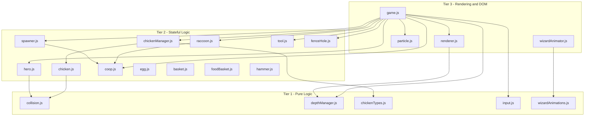

# Testing Architecture — Chickens: Wizard's Backyard

> **Purpose:** Complete specification for adding a test infrastructure to this vanilla JS browser game.  
> **Target:** Windows 11, cmd.exe, VS Code  
> **Constraint:** The game must continue to work in the browser via `<script>` tags — no breaking changes to `index.html`.

---

## Table of Contents

1. [Module Export Strategy](#1-module-export-strategy)
2. [Test Framework Setup](#2-test-framework-setup)
3. [Test File Structure](#3-test-file-structure)
4. [Canvas Mocking Strategy](#4-canvas-mocking-strategy)
5. [Test Coverage Plan](#5-test-coverage-plan)
6. [ESLint + Prettier Configuration](#6-eslint--prettier-configuration)
7. [VS Code Integration](#7-vs-code-integration)
8. [npm Scripts](#8-npm-scripts)
9. [CI Pipeline](#9-ci-pipeline-github-actions)

---

## 1. Module Export Strategy

### Problem

Every source file declares classes and constants as globals (e.g., `class Collision { ... }`). The browser loads them via `<script>` tags in `index.html`. Node/Vitest needs `import`/`export` statements to load them.

### Solution: Conditional Export Footer

Append a **conditional export block** to the bottom of each source file. The browser ignores it (no `module` global), and Node picks it up.

#### Pattern — Single Class Export

```js
// --- END OF FILE ---
// Dual-mode export: browser globals + Node/test imports
if (typeof module !== 'undefined' && module.exports) {
    module.exports = { Collision };
}
```

#### Pattern — Multiple Exports (classes + constants)

```js
// --- END OF FILE ---
if (typeof module !== 'undefined' && module.exports) {
    module.exports = { Chicken, CHICKEN_TYPE_TEMPLATES };
}
```

#### Pattern — File With Dependencies (import needed in Node)

For files that reference globals from other files, add a **conditional require** block at the **top** of the file (after the JSDoc comment):

```js
// Conditional require for Node/test environment
if (typeof require !== 'undefined') {
    if (typeof Chicken === 'undefined') {
        var Chicken = require('./chicken.js').Chicken;
    }
    if (typeof CHICKEN_TYPES === 'undefined') {
        var CHICKEN_TYPES = require('./chickenTypes.js').CHICKEN_TYPES;
    }
}
```

> **Why `var` instead of `const`?** Using `var` avoids redeclaration errors in the browser where the global already exists. In the browser these lines are never reached (the `typeof require` check fails). In Node, `var` at module scope behaves like `let`.

### Complete File-by-File Export Map

| File | Exports | Dependencies (conditional require) |
|------|---------|-----------------------------------|
| `collision.js` | `{ Collision }` | None |
| `depthManager.js` | `{ DepthManager }` | None |
| `input.js` | `{ InputHandler }` | None (uses `window` — needs jsdom) |
| `chickenTypes.js` | `{ CHICKEN_TYPES, TypedChicken }` | `Chicken` from `chicken.js` |
| `chicken.js` | `{ Chicken, CHICKEN_TYPE_TEMPLATES }` | None |
| `chickenManager.js` | `{ ChickenManager }` | `CHICKEN_TYPES`, `TypedChicken` from `chickenTypes.js` |
| `egg.js` | `{ Egg, EggManager }` | None |
| `basket.js` | `{ BasketItem, HouseDepositZone }` | None |
| `foodBasket.js` | `{ FoodBasketItem }` | None |
| `hammer.js` | `{ HammerItem }` | None |
| `tool.js` | `{ Tool, ToolManager }` | None |
| `fenceHole.js` | `{ FenceHole, FenceHoleManager }` | None |
| `spawner.js` | `{ Spawner }` | `Chicken` from `chicken.js` |
| `coop.js` | `{ Coop }` | None |
| `raccoon.js` | `{ Raccoon, RaccoonSpawner }` | None |
| `hero.js` | `{ Hero }` | None |
| `particle.js` | `{ Particle, WizardSparkle, MagicBurst, MagicRune, PawPrint, StarBurst, WoodParticle, ParticleSystem }` | None |
| `wizardAnimations.js` | `{ IDLE_FRAMES, WALK_FRAMES, TURN_FRAMES, PICKUP_FRAMES, CARRY_FRAMES, DEPOSIT_FRAMES, STARTLED_FRAMES, VICTORY_FRAMES, HAMMER_FRAMES, WIZARD_ANIMATIONS, defaultLimb }` | None |
| `wizardAnimator.js` | `{ WizardAnimator }` | `WIZARD_ANIMATIONS` from `wizardAnimations.js` |
| `renderer.js` | `{ Renderer }` | None (uses `canvas` — needs jsdom/mock) |
| `game.js` | `{ Game }` | Everything (integration root) |

### Verification

After adding exports, verify the browser still works by opening `index.html` in a browser — the `typeof module` guard ensures the export block is dead code in the browser.

---

## 2. Test Framework Setup

### Packages

```
npm init -y
npm install --save-dev vitest @vitest/coverage-v8 jsdom playwright @playwright/test
npm install --save-dev eslint @eslint/js prettier eslint-config-prettier
```

Exact packages and purposes:

| Package | Version | Purpose |
|---------|---------|---------|
| `vitest` | latest | Unit + integration test runner |
| `@vitest/coverage-v8` | latest | Code coverage via V8 |
| `jsdom` | latest | DOM + Canvas simulation for Node |
| `playwright` | latest | Browser automation engine |
| `@playwright/test` | latest | E2E test runner |
| `eslint` | latest (v9+) | Linting |
| `@eslint/js` | latest | ESLint recommended config |
| `prettier` | latest | Code formatting |
| `eslint-config-prettier` | latest | Disable ESLint rules that conflict with Prettier |

After install, run Playwright browser setup:

```
npx playwright install chromium
```

### vitest.config.js

```js
import { defineConfig } from 'vitest/config';

export default defineConfig({
    test: {
        // Use jsdom for DOM/Canvas APIs
        environment: 'jsdom',

        // Test file patterns
        include: ['tests/**/*.test.js'],

        // Coverage configuration
        coverage: {
            provider: 'v8',
            reporter: ['text', 'html', 'lcov'],
            include: ['*.js'],
            exclude: ['vitest.config.js', 'eslint.config.js', 'tests/**'],
            thresholds: {
                statements: 50,
                branches: 40,
                functions: 50,
                lines: 50
            }
        },

        // Global test timeout
        testTimeout: 10000,

        // Setup files run before each test file
        setupFiles: ['tests/setup.js']
    }
});
```

### playwright.config.js

```js
import { defineConfig } from '@playwright/test';

export default defineConfig({
    testDir: 'tests/e2e',
    timeout: 30000,
    retries: 1,
    use: {
        browserName: 'chromium',
        headless: true,
        baseURL: 'http://localhost:5500',
        screenshot: 'only-on-failure'
    },
    webServer: {
        command: 'npx serve . -l 5500 --no-clipboard',
        port: 5500,
        reuseExistingServer: true
    }
});
```

> **Note:** The `serve` package must also be installed: `npm install --save-dev serve`

Update the install command to include it:

```
npm install --save-dev vitest @vitest/coverage-v8 jsdom playwright @playwright/test eslint @eslint/js prettier eslint-config-prettier serve
```

---

## 3. Test File Structure

```
chickens/
├── tests/
│   ├── setup.js                    # Global test setup (canvas mock, DOM stubs)
│   ├── helpers/
│   │   ├── canvasMock.js           # Canvas 2D context mock factory
│   │   └── gameMock.js             # Game state mock factory
│   ├── unit/
│   │   ├── collision.test.js       # Pure math — circle, rect, distance
│   │   ├── depthManager.test.js    # Y-sort, roof geometry
│   │   ├── chickenTypes.test.js    # Type config validation
│   │   ├── input.test.js           # Key tracking
│   │   ├── chicken.test.js         # Chicken AI states, movement
│   │   ├── hero.test.js            # Wizard movement, bag, spells
│   │   ├── coop.test.js            # Coop logic, deposit, spawn positions
│   │   ├── raccoon.test.js         # Raccoon state machine
│   │   ├── spawner.test.js         # Spawn timing, difficulty
│   │   ├── chickenManager.test.js  # Collection management
│   │   ├── egg.test.js             # Egg + EggManager
│   │   ├── tool.test.js            # Tool + ToolManager
│   │   ├── fenceHole.test.js       # FenceHole + FenceHoleManager
│   │   ├── basket.test.js          # BasketItem + HouseDepositZone
│   │   ├── foodBasket.test.js      # FoodBasketItem
│   │   ├── hammer.test.js          # HammerItem
│   │   ├── particle.test.js        # Particle system update logic
│   │   ├── wizardAnimations.test.js # Animation frame data validation
│   │   └── wizardAnimator.test.js  # State machine transitions
│   ├── integration/
│   │   ├── heroChicken.test.js     # Hero catching/depositing chickens
│   │   ├── raccoonCoop.test.js     # Raccoon raid sequence
│   │   ├── fenceRepair.test.js     # Hammer + fence hole repair flow
│   │   └── gameLoop.test.js        # Game.update() one-frame integration
│   └── e2e/
│       ├── gameStart.spec.js       # Start screen → gameplay transition
│       ├── chickenCatch.spec.js    # Full catch-and-deposit flow
│       └── gameOver.spec.js        # Win/lose conditions
├── vitest.config.js
├── playwright.config.js
├── eslint.config.js
├── .prettierrc
└── package.json
```

### Naming Conventions

| Type | Pattern | Runner |
|------|---------|--------|
| Unit tests | `tests/unit/<module>.test.js` | Vitest |
| Integration tests | `tests/integration/<scenario>.test.js` | Vitest |
| E2E tests | `tests/e2e/<scenario>.spec.js` | Playwright |

---

## 4. Canvas Mocking Strategy

### The Problem

Most game classes call `ctx.save()`, `ctx.restore()`, `ctx.fillRect()`, `ctx.arc()`, `ctx.beginPath()`, `ctx.createLinearGradient()`, etc. jsdom provides a basic `<canvas>` element but its `getContext('2d')` returns `null` by default.

### Solution: Mock Canvas Factory

Create `tests/helpers/canvasMock.js`:

```js
/**
 * Creates a mock Canvas 2D rendering context with all standard methods stubbed.
 * Every method is a no-op vi.fn() so tests can assert calls without real rendering.
 */
function createMockCanvas(width = 800, height = 600) {
    const gradientMock = {
        addColorStop: vi.fn()
    };

    const patternMock = {};

    const ctx = {
        // State
        save: vi.fn(),
        restore: vi.fn(),

        // Transform
        translate: vi.fn(),
        rotate: vi.fn(),
        scale: vi.fn(),
        setTransform: vi.fn(),
        resetTransform: vi.fn(),
        transform: vi.fn(),

        // Compositing
        globalAlpha: 1,
        globalCompositeOperation: 'source-over',

        // Drawing styles
        fillStyle: '#000',
        strokeStyle: '#000',
        lineWidth: 1,
        lineCap: 'butt',
        lineJoin: 'miter',
        shadowColor: 'rgba(0,0,0,0)',
        shadowBlur: 0,
        shadowOffsetX: 0,
        shadowOffsetY: 0,
        font: '10px sans-serif',
        textAlign: 'start',
        textBaseline: 'alphabetic',

        // Rectangles
        fillRect: vi.fn(),
        strokeRect: vi.fn(),
        clearRect: vi.fn(),

        // Paths
        beginPath: vi.fn(),
        closePath: vi.fn(),
        moveTo: vi.fn(),
        lineTo: vi.fn(),
        arc: vi.fn(),
        arcTo: vi.fn(),
        ellipse: vi.fn(),
        bezierCurveTo: vi.fn(),
        quadraticCurveTo: vi.fn(),
        rect: vi.fn(),
        roundRect: vi.fn(),
        fill: vi.fn(),
        stroke: vi.fn(),
        clip: vi.fn(),

        // Text
        fillText: vi.fn(),
        strokeText: vi.fn(),
        measureText: vi.fn(() => ({ width: 0 })),

        // Gradients / Patterns
        createLinearGradient: vi.fn(() => gradientMock),
        createRadialGradient: vi.fn(() => gradientMock),
        createPattern: vi.fn(() => patternMock),

        // Pixel manipulation
        getImageData: vi.fn(() => ({
            data: new Uint8ClampedArray(width * height * 4)
        })),
        putImageData: vi.fn(),
        createImageData: vi.fn(),

        // Drawing images
        drawImage: vi.fn(),

        // Canvas reference
        canvas: {
            width,
            height,
            getContext: vi.fn(),
            getBoundingClientRect: vi.fn(() => ({
                top: 0, left: 0, width, height, right: width, bottom: height
            }))
        }
    };

    // Make canvas.getContext return itself
    ctx.canvas.getContext = vi.fn(() => ctx);

    return { canvas: ctx.canvas, ctx };
}

module.exports = { createMockCanvas };
```

### Usage in Tests

```js
import { describe, it, expect, vi, beforeEach } from 'vitest';
import { createMockCanvas } from '../helpers/canvasMock.js';

// Suppose we want to test Renderer
const { Renderer } = require('../../renderer.js');

describe('Renderer', () => {
    let renderer, ctx, canvas;

    beforeEach(() => {
        const mock = createMockCanvas();
        canvas = mock.canvas;
        ctx = mock.ctx;
        renderer = new Renderer(canvas);
    });

    it('should call clearRect on clear', () => {
        renderer.clear();
        // The renderer draws sky, fences, lawn, etc.
        // We verify the ctx methods were called
        expect(ctx.fillRect).toHaveBeenCalled();
    });
});
```

### Global DOM Setup — tests/setup.js

```js
/**
 * Global test setup — runs before every test file.
 * Sets up minimal DOM elements that game classes expect.
 */
import { vi } from 'vitest';

// Create DOM elements that Game constructor expects
function setupDOM() {
    document.body.innerHTML = `
        <div class="game-container">
            <div id="chickenCards" class="chicken-cards-container"></div>
            <canvas id="gameCanvas" width="800" height="600"></canvas>
            <span id="score">0/50</span>
            <span id="bagDisplay">○○</span>
            <span id="lives">3</span>
            <span id="time">0:00</span>
            <div id="spellBar" class="spell-bar">
                <div class="spell-slot" data-slot="0"><span class="spell-cooldown"></span></div>
                <div class="spell-slot" data-slot="1"><span class="spell-cooldown"></span></div>
                <div class="spell-slot" data-slot="2"><span class="spell-cooldown"></span></div>
            </div>
            <div id="interactionPrompt" class="interaction-prompt hidden">
                <span class="action">INTERACT</span>
            </div>
            <div id="startScreen" class="overlay"><button id="startBtn"></button></div>
            <div id="gameOverScreen" class="overlay hidden">
                <span id="finalScore">0</span>
                <span id="highScore">0</span>
                <span id="finalTime">0:00</span>
                <button id="restartBtn"></button>
            </div>
        </div>
    `;
}

// Stub canvas getContext since jsdom does not implement Canvas 2D natively
const mockCtx = {
    save: vi.fn(),
    restore: vi.fn(),
    translate: vi.fn(),
    rotate: vi.fn(),
    scale: vi.fn(),
    setTransform: vi.fn(),
    resetTransform: vi.fn(),
    fillRect: vi.fn(),
    strokeRect: vi.fn(),
    clearRect: vi.fn(),
    beginPath: vi.fn(),
    closePath: vi.fn(),
    moveTo: vi.fn(),
    lineTo: vi.fn(),
    arc: vi.fn(),
    arcTo: vi.fn(),
    ellipse: vi.fn(),
    bezierCurveTo: vi.fn(),
    quadraticCurveTo: vi.fn(),
    rect: vi.fn(),
    fill: vi.fn(),
    stroke: vi.fn(),
    clip: vi.fn(),
    fillText: vi.fn(),
    strokeText: vi.fn(),
    measureText: vi.fn(() => ({ width: 0 })),
    createLinearGradient: vi.fn(() => ({ addColorStop: vi.fn() })),
    createRadialGradient: vi.fn(() => ({ addColorStop: vi.fn() })),
    createPattern: vi.fn(),
    drawImage: vi.fn(),
    getImageData: vi.fn(() => ({ data: new Uint8ClampedArray(800 * 600 * 4) })),
    putImageData: vi.fn(),
    globalAlpha: 1,
    globalCompositeOperation: 'source-over',
    fillStyle: '#000',
    strokeStyle: '#000',
    lineWidth: 1,
    font: '10px sans-serif',
    textAlign: 'start',
    textBaseline: 'alphabetic',
    shadowColor: 'rgba(0,0,0,0)',
    shadowBlur: 0,
    shadowOffsetX: 0,
    shadowOffsetY: 0,
    lineCap: 'butt',
    lineJoin: 'miter'
};

// Override HTMLCanvasElement.prototype.getContext so any <canvas> returns our mock
HTMLCanvasElement.prototype.getContext = vi.fn(function () {
    mockCtx.canvas = this;
    return mockCtx;
});

// Stub requestAnimationFrame (game loop uses it)
global.requestAnimationFrame = vi.fn((cb) => setTimeout(cb, 16));
global.cancelAnimationFrame = vi.fn((id) => clearTimeout(id));

// Run DOM setup
setupDOM();
```

---

## 5. Test Coverage Plan

### Tier 1 — Pure Logic (Easy to Test)

These files contain no DOM or Canvas dependencies. They are pure functions or stateless data.

#### collision.js

**Classes:** `Collision` (all static methods)  
**What to test:**
- `circleCircle()` — overlapping circles return true, separated return false, edge case at exact touch
- `outsideBounds()` — circle inside, outside each edge, exactly on boundary
- `distance()` — known triangle (3-4-5), zero distance, large values
- `pointInRect()` — corners, center, outside each side
- `circleRect()` — overlap on each side, corner case, no overlap
- `nearestPointOnRect()` — point inside, point outside each direction
- `clamp()` — within range, below min, above max

**Mocks needed:** None

---

#### depthManager.js

**Classes:** `DepthManager`  
**What to test:**
- `getRoofYAt(x)` — center (400 → 500), edges (0 → 600, 800 → 600)
- `getEntityDepthY()` — entity with default height, custom height
- `isBehindRoof()` — entity clearly behind, clearly in front, at boundary
- `sortByDepth()` — array of entities sorted correctly by Y
- `partitionByRoof()` — entities split into behind/inFront arrays

**Mocks needed:** None

---

#### chickenTypes.js

**Classes:** `TypedChicken` (extends `Chicken`), **Constants:** `CHICKEN_TYPES`  
**What to test:**
- All 12 chicken types exist in `CHICKEN_TYPES`
- Each type has required fields: `name`, `icon`, `bodyColor`, `speedMod`, `eggRateMod`, `special`
- `TypedChicken` constructor initializes type-specific properties
- `TypedChicken` inherits from `Chicken` correctly

**Mocks needed:** `Chicken` class (conditional require from `chicken.js`)

---

#### input.js

**Classes:** `InputHandler`  
**What to test:**
- `isDown(key)` returns false initially
- Simulated `keydown` event sets key to true
- Simulated `keyup` event sets key to false
- `justPressed()` returns true only once per press
- `clearJustPressed()` resets the one-shot flags
- Shift key variations (ShiftLeft, ShiftRight) all map to `shift`

**Mocks needed:** `window` events (provided by jsdom)

---

### Tier 2 — Stateful Logic (Medium)

These files have state machines, timers, and entity interactions but their core logic can be tested without Canvas.

#### chicken.js

**Classes:** `Chicken`, **Constants:** `CHICKEN_TYPE_TEMPLATES`  
**What to test:**
- Constructor defaults (position, state, hunger, timers)
- `update()` advances timers, hunger decays
- State transitions: `inCoop` → egg laying → escape timer
- `feed()` resets hunger
- `collectEgg()` clears egg state
- Movement direction calculation
- Escape detection (`y > threshold`)

**Mocks needed:** Stub `draw()` method (calls `ctx`); or skip draw tests here

---

#### hero.js

**Classes:** `Hero`  
**What to test:**
- Constructor defaults (position, speed, bag empty)
- `update()` with input keys → position changes
- Sprint mode (shift key → higher speed)
- Tool pickup/drop (`currentTool` state)
- Deposit channel timer (isDepositing, timer countdown)
- Repair state (isRepairing, timer)
- Spell cooldown tracking
- Bag system: pick up chicken, bag full check, deposit chicken

**Mocks needed:** `InputHandler` (inject or mock), Canvas `ctx` for `draw()`

---

#### coop.js

**Classes:** `Coop`  
**What to test:**
- Constructor geometry (position, dimensions, fence boundaries)
- `getSpawnPosition()` returns positions within coop bounds
- `isInsideCoop(x, y)` boundary check
- `isInsideFence(x, y)` fence boundary check
- Deposit logic: score increment, chicken count
- Egg spawn positions
- `leaveCoop()` method for raccoon spook behavior

**Mocks needed:** Canvas `ctx` for `draw()`

---

#### raccoon.js

**Classes:** `Raccoon`, `RaccoonSpawner`  
**What to test:**
- State machine transitions: `spawning` → `approaching` → `entering_coop` → `inside_coop` → `exiting_coop` → `dragging` → `escaped`
- Wizard intercept transitions to `fleeing`
- Movement toward coop center
- Grabbed chicken reference
- `RaccoonSpawner`: spawn timing, difficulty scaling

**Mocks needed:** `Coop` object (stub geometry), Canvas `ctx` for `draw()`

---

#### spawner.js

**Classes:** `Spawner`  
**What to test:**
- `update()` returns `true` when spawn timer exceeds rate
- Timer resets after spawn
- Difficulty increases reduce spawn rate
- `maxChickens` cap respected
- `reset()` restores initial values

**Mocks needed:** `Coop` object for `getSpawnPosition()`

---

#### chickenManager.js

**Classes:** `ChickenManager`  
**What to test:**
- `spawnChickens()` creates 12 chickens (one per type)
- `getChickenByType()` finds correct chicken
- `getInCoopCount()` / `getEscapedCount()` filtering
- `update()` propagates deltaTime to all chickens, returns escaped list
- `getChickensWithEggs()` / `getHungryChickens()` filters

**Mocks needed:** `CHICKEN_TYPES`, `TypedChicken`, `Coop`

---

#### egg.js

**Classes:** `Egg`, `EggManager`  
**What to test:**
- `Egg.update()` advances wobble animation
- `EggManager` spawning, collection tracking

**Mocks needed:** Canvas `ctx` for `draw()`

---

#### tool.js

**Classes:** `Tool`, `ToolManager`  
**What to test:**
- `Tool` constructor sets correct `maxUses` per type
- `Tool.use()` decrements uses
- `Tool.isDepleted()` returns true when uses = 0
- `ToolManager` spawns tools at correct positions, handles respawn

**Mocks needed:** Canvas `ctx` for `draw()`

---

#### fenceHole.js

**Classes:** `FenceHole`, `FenceHoleManager`  
**What to test:**
- `FenceHole` leak timer advances, returns `true` at interval
- Repair progress increments
- `FenceHoleManager` creates holes on correct sides
- Manager removal after full repair

**Mocks needed:** Canvas `ctx` for `draw()`

---

#### basket.js / foodBasket.js / hammer.js

**Classes:** `BasketItem`, `HouseDepositZone`, `FoodBasketItem`, `HammerItem`  
**What to test:**
- `checkPickup(hero)` distance calculation
- `collect()` / `respawn()` state toggle
- `getBounds()` returns correct shape

**Mocks needed:** Canvas `ctx` for `draw()`

---

### Tier 3 — Rendering/DOM (Hard)

These files are tightly coupled to Canvas 2D context. Focus on testing logic paths, not pixel output.

#### renderer.js

**Classes:** `Renderer`  
**What to test:**
- Constructor stores canvas reference
- `clear()` calls expected draw methods (verify method call order)
- Individual draw methods (`drawSky`, `drawNorthFence`, etc.) call ctx APIs
- `drawHouseRoof()` uses correct geometry

**Mocks needed:** Full Canvas mock from `canvasMock.js`

---

#### particle.js

**Classes:** `Particle`, `WizardSparkle`, `MagicBurst`, `MagicRune`, `PawPrint`, `StarBurst`, `WoodParticle`, `ParticleSystem`  
**What to test:**
- Each particle type initializes with correct velocity/color/decay for its type
- `update()` decays life correctly
- `ParticleSystem.update()` removes dead particles
- `ParticleSystem.emit()` creates correct number of particles

**Mocks needed:** Canvas `ctx` for `draw()` methods

---

#### wizardAnimations.js

**Constants:** `IDLE_FRAMES`, `WALK_FRAMES`, `TURN_FRAMES`, `PICKUP_FRAMES`, `CARRY_FRAMES`, `DEPOSIT_FRAMES`, `STARTLED_FRAMES`, `VICTORY_FRAMES`, `HAMMER_FRAMES`, `WIZARD_ANIMATIONS`, `defaultLimb`  
**What to test:**
- Each animation array has > 0 frames
- Each frame has required properties (`bodyY`, `bodyScaleY`, `legL`, `legR`, `armL`, `armR`)
- `WIZARD_ANIMATIONS` maps all animation names to frame arrays
- `defaultLimb` has `angle`, `x`, `y`

**Mocks needed:** None (pure data)

---

#### wizardAnimator.js

**Classes:** `WizardAnimator`  
**What to test:**
- Initial state is `idle`
- `setState()` transitions between states
- `update()` advances frame counter
- Loop vs non-loop behavior
- Transition blending logic
- `getCurrentPose()` returns interpolated frame data

**Mocks needed:** `WIZARD_ANIMATIONS` from `wizardAnimations.js`

---

#### game.js

**Classes:** `Game`  
**What to test (integration-level):**
- Constructor initializes all sub-systems
- `update(dt)` calls update on all managers
- State transitions: `menu` → `playing` → `won` / `lost`
- Score tracking, lives tracking
- Win condition (50 eggs deposited)
- Lose condition (all chickens escaped)

**Mocks needed:** Full DOM (from `setup.js`), Canvas mock, all game subsystems

---

### Coverage Strategy Diagram



---

## 6. ESLint + Prettier Configuration

### eslint.config.js (flat config — ESLint v9+)

```js
import js from '@eslint/js';

export default [
    js.configs.recommended,
    {
        files: ['*.js'],
        languageOptions: {
            ecmaVersion: 2022,
            sourceType: 'script',
            globals: {
                // Browser globals
                window: 'readonly',
                document: 'readonly',
                console: 'readonly',
                requestAnimationFrame: 'readonly',
                cancelAnimationFrame: 'readonly',
                setTimeout: 'readonly',
                clearTimeout: 'readonly',
                setInterval: 'readonly',
                clearInterval: 'readonly',
                HTMLCanvasElement: 'readonly',
                localStorage: 'readonly',
                performance: 'readonly',
                Date: 'readonly',

                // Node.js conditional export guard
                module: 'readonly',
                require: 'readonly',

                // Game globals (loaded via script tags)
                Collision: 'readonly',
                DepthManager: 'readonly',
                InputHandler: 'readonly',
                Renderer: 'readonly',
                Particle: 'readonly',
                WizardSparkle: 'readonly',
                MagicBurst: 'readonly',
                MagicRune: 'readonly',
                PawPrint: 'readonly',
                StarBurst: 'readonly',
                WoodParticle: 'readonly',
                ParticleSystem: 'readonly',
                WizardAnimator: 'readonly',
                WIZARD_ANIMATIONS: 'readonly',
                IDLE_FRAMES: 'readonly',
                WALK_FRAMES: 'readonly',
                TURN_FRAMES: 'readonly',
                PICKUP_FRAMES: 'readonly',
                CARRY_FRAMES: 'readonly',
                DEPOSIT_FRAMES: 'readonly',
                STARTLED_FRAMES: 'readonly',
                VICTORY_FRAMES: 'readonly',
                HAMMER_FRAMES: 'readonly',
                defaultLimb: 'readonly',
                Chicken: 'readonly',
                CHICKEN_TYPE_TEMPLATES: 'readonly',
                CHICKEN_TYPES: 'readonly',
                TypedChicken: 'readonly',
                ChickenManager: 'readonly',
                Coop: 'readonly',
                Hero: 'readonly',
                Raccoon: 'readonly',
                RaccoonSpawner: 'readonly',
                Spawner: 'readonly',
                FenceHole: 'readonly',
                FenceHoleManager: 'readonly',
                Tool: 'readonly',
                ToolManager: 'readonly',
                Egg: 'readonly',
                EggManager: 'readonly',
                BasketItem: 'readonly',
                HouseDepositZone: 'readonly',
                FoodBasketItem: 'readonly',
                HammerItem: 'readonly',
                Game: 'readonly'
            }
        },
        rules: {
            'no-unused-vars': ['warn', { argsIgnorePattern: '^_' }],
            'no-console': 'off',
            'no-var': 'off',           // We use var for conditional requires
            'prefer-const': 'warn',
            'eqeqeq': ['error', 'always'],
            'no-implicit-globals': 'off' // All our classes are intentional globals
        }
    },
    {
        files: ['tests/**/*.js'],
        languageOptions: {
            ecmaVersion: 2022,
            sourceType: 'module',
            globals: {
                // Vitest globals
                vi: 'readonly',
                describe: 'readonly',
                it: 'readonly',
                expect: 'readonly',
                beforeEach: 'readonly',
                afterEach: 'readonly',
                beforeAll: 'readonly',
                afterAll: 'readonly'
            }
        }
    },
    {
        files: ['vitest.config.js', 'playwright.config.js', 'eslint.config.js'],
        languageOptions: {
            sourceType: 'module'
        }
    }
];
```

### .prettierrc

```json
{
    "singleQuote": true,
    "tabWidth": 4,
    "semi": true,
    "trailingComma": "none",
    "bracketSpacing": true,
    "arrowParens": "always",
    "endOfLine": "crlf",
    "printWidth": 100
}
```

### .prettierignore

```
node_modules
coverage
playwright-report
```

---

## 7. VS Code Integration

### .vscode/tasks.json

```json
{
    "version": "2.0.0",
    "tasks": [
        {
            "label": "Test: Run All",
            "type": "shell",
            "command": "npx vitest run",
            "group": {
                "kind": "test",
                "isDefault": true
            },
            "problemMatcher": [],
            "presentation": {
                "reveal": "always",
                "panel": "shared"
            }
        },
        {
            "label": "Test: Watch Mode",
            "type": "shell",
            "command": "npx vitest",
            "group": "test",
            "isBackground": true,
            "problemMatcher": [],
            "presentation": {
                "reveal": "always",
                "panel": "dedicated"
            }
        },
        {
            "label": "Test: Coverage",
            "type": "shell",
            "command": "npx vitest run --coverage",
            "group": "test",
            "problemMatcher": [],
            "presentation": {
                "reveal": "always",
                "panel": "shared"
            }
        },
        {
            "label": "Test: E2E (Playwright)",
            "type": "shell",
            "command": "npx playwright test",
            "group": "test",
            "problemMatcher": [],
            "presentation": {
                "reveal": "always",
                "panel": "shared"
            }
        },
        {
            "label": "Dev Server",
            "type": "shell",
            "command": "npx serve . -l 5500 --no-clipboard",
            "group": "none",
            "isBackground": true,
            "problemMatcher": [],
            "presentation": {
                "reveal": "always",
                "panel": "dedicated"
            }
        },
        {
            "label": "Lint: Check",
            "type": "shell",
            "command": "npx eslint *.js",
            "group": "build",
            "problemMatcher": ["$eslint-stylish"],
            "presentation": {
                "reveal": "always",
                "panel": "shared"
            }
        },
        {
            "label": "Lint: Fix",
            "type": "shell",
            "command": "npx eslint *.js --fix",
            "group": "build",
            "problemMatcher": ["$eslint-stylish"],
            "presentation": {
                "reveal": "always",
                "panel": "shared"
            }
        },
        {
            "label": "Format: Check",
            "type": "shell",
            "command": "npx prettier --check *.js",
            "group": "build",
            "problemMatcher": [],
            "presentation": {
                "reveal": "always",
                "panel": "shared"
            }
        },
        {
            "label": "Format: Fix",
            "type": "shell",
            "command": "npx prettier --write *.js",
            "group": "build",
            "problemMatcher": [],
            "presentation": {
                "reveal": "always",
                "panel": "shared"
            }
        }
    ]
}
```

### .vscode/launch.json

```json
{
    "version": "0.2.0",
    "configurations": [
        {
            "type": "node",
            "request": "launch",
            "name": "Debug Current Test File",
            "autoAttachChildProcesses": true,
            "skipFiles": ["<node_internals>/**", "**/node_modules/**"],
            "program": "${workspaceRoot}/node_modules/vitest/vitest.mjs",
            "args": ["run", "${relativeFile}"],
            "smartStep": true,
            "console": "integratedTerminal"
        },
        {
            "type": "node",
            "request": "launch",
            "name": "Debug All Tests",
            "autoAttachChildProcesses": true,
            "skipFiles": ["<node_internals>/**", "**/node_modules/**"],
            "program": "${workspaceRoot}/node_modules/vitest/vitest.mjs",
            "args": ["run"],
            "smartStep": true,
            "console": "integratedTerminal"
        }
    ]
}
```

### .vscode/extensions.json (updated)

```json
{
    "recommendations": [
        "kilocode.kilo-code",
        "dbaeumer.vscode-eslint",
        "esbenp.prettier-vscode",
        "vitest.explorer"
    ]
}
```

---

## 8. npm Scripts

### package.json scripts section

```json
{
    "name": "chickens-wizards-backyard",
    "version": "1.0.0",
    "private": true,
    "description": "Chickens: Wizard's Backyard - A vanilla JS browser game",
    "scripts": {
        "test": "vitest run",
        "test:watch": "vitest",
        "test:coverage": "vitest run --coverage",
        "test:ui": "vitest --ui",
        "test:e2e": "npx playwright test",
        "test:e2e:headed": "npx playwright test --headed",
        "test:e2e:debug": "npx playwright test --debug",
        "test:all": "vitest run && npx playwright test",
        "lint": "eslint *.js",
        "lint:fix": "eslint *.js --fix",
        "format": "prettier --check \"*.js\" \"tests/**/*.js\"",
        "format:fix": "prettier --write \"*.js\" \"tests/**/*.js\"",
        "serve": "serve . -l 5500 --no-clipboard",
        "check": "eslint *.js && prettier --check \"*.js\""
    },
    "devDependencies": {
        "@eslint/js": "^9.0.0",
        "@playwright/test": "^1.50.0",
        "@vitest/coverage-v8": "^3.0.0",
        "eslint": "^9.0.0",
        "eslint-config-prettier": "^10.0.0",
        "jsdom": "^26.0.0",
        "playwright": "^1.50.0",
        "prettier": "^3.0.0",
        "serve": "^14.0.0",
        "vitest": "^3.0.0"
    }
}
```

### Installation Commands (cmd.exe)

```cmd
npm init -y
npm install --save-dev vitest @vitest/coverage-v8 jsdom playwright @playwright/test eslint @eslint/js prettier eslint-config-prettier serve
npx playwright install chromium
```

---

## 9. CI Pipeline (GitHub Actions)

### .github/workflows/test.yml

```yaml
name: Tests

on:
  push:
    branches: [main, develop]
  pull_request:
    branches: [main]

jobs:
  unit-tests:
    runs-on: windows-latest
    steps:
      - uses: actions/checkout@v4

      - uses: actions/setup-node@v4
        with:
          node-version: '20'
          cache: 'npm'

      - name: Install dependencies
        run: npm ci

      - name: Run linter
        run: npm run lint

      - name: Check formatting
        run: npm run format

      - name: Run unit tests with coverage
        run: npm run test:coverage

      - name: Upload coverage report
        uses: actions/upload-artifact@v4
        with:
          name: coverage-report
          path: coverage/

  e2e-tests:
    runs-on: windows-latest
    needs: unit-tests
    steps:
      - uses: actions/checkout@v4

      - uses: actions/setup-node@v4
        with:
          node-version: '20'
          cache: 'npm'

      - name: Install dependencies
        run: npm ci

      - name: Install Playwright browsers
        run: npx playwright install chromium

      - name: Run E2E tests
        run: npm run test:e2e

      - name: Upload Playwright report
        uses: actions/upload-artifact@v4
        if: always()
        with:
          name: playwright-report
          path: playwright-report/
```

### .gitignore additions

```
node_modules/
coverage/
playwright-report/
test-results/
```

---

## Implementation Order

When implementing this architecture, follow this order:

1. **Initialize npm and install packages** — `npm init -y`, install all devDependencies
2. **Add conditional exports** to every source file (bottom footer pattern)
3. **Create `tests/setup.js`** — DOM scaffolding + canvas mock
4. **Create `tests/helpers/canvasMock.js`** — reusable mock factory
5. **Create config files** — `vitest.config.js`, `playwright.config.js`, `eslint.config.js`, `.prettierrc`, `.prettierignore`
6. **Create VS Code configs** — `.vscode/tasks.json`, `.vscode/launch.json`, update `extensions.json`
7. **Write Tier 1 tests first** — `collision.test.js`, `depthManager.test.js`, `chickenTypes.test.js`, `input.test.js`, `wizardAnimations.test.js`
8. **Write Tier 2 tests** — stateful logic tests with mocked draw methods
9. **Write Tier 3 tests** — renderer, particle, game integration
10. **Write E2E tests** — Playwright specs for full game flows
11. **Configure CI** — `.github/workflows/test.yml`
12. **Verify browser still works** — open `index.html`, confirm no regressions
